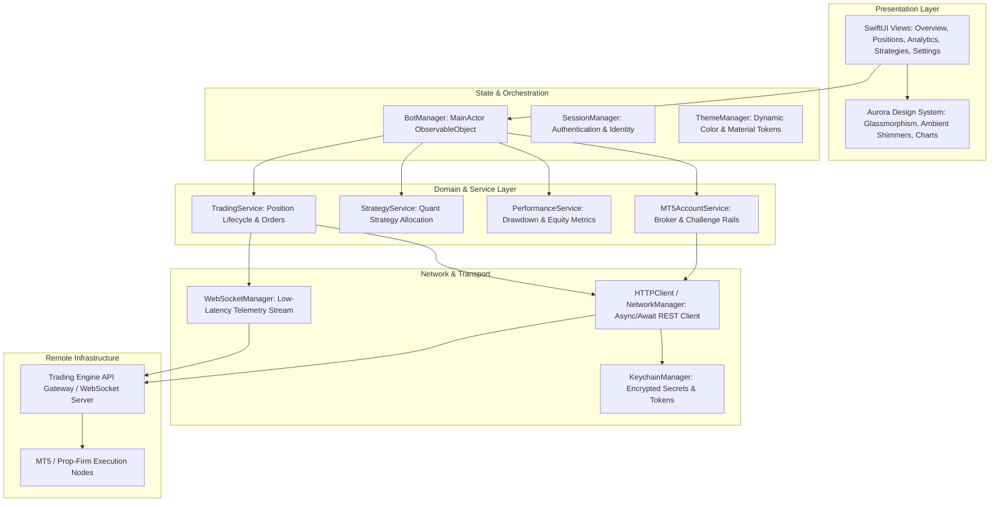

# Aurora: iOS Algorithmic Trading Operations & Portfolio Cockpit

Aurora is an institutional-grade iOS trading companion and telemetry platform designed to monitor, parameterize, and supervise autonomous quantitative trading bots and prop-firm execution engines in real time.

Built natively with **SwiftUI**, **Combine**, and modern **Swift Concurrency**, Aurora pairs low-latency streaming infrastructure with a bespoke, Apple-grade glassmorphic design system to deliver deep execution analytics, live position telemetry, and multi-broker account management.

---

## Architecture Overview

Aurora adopts a unidirectional data flow and modular MVVM architecture, separating UI components, state management, asynchronous networking, and security layers.



---

## Key Features

### 1. Real-Time Telemetry & Bot Supervision
- **Live Heartbeat & State Synchronization**: Bi-directional telemetry monitoring bot operational state (`Running`, `Paused`, `Halted`, `Error`), latency, and execution loops.
- **Remote Bot Controls**: Emergency kill-switch, execution pause, strategy toggle, and dynamic parameter adjustment over encrypted channels.
- **Dual-Channel Networking**: Low-latency WebSocket event streaming with automatic exponential backoff reconnection and seamless REST polling fallback.

### 2. Execution Telemetry & Position Tracking
- **Live Positions**: Real-time floating P&L, lot sizing, open price, mark price, stop-loss, take-profit, and risk-reward ratios.
- **Order Flow & Trade History**: Historical execution logs with slippage metrics, trade duration, entry/exit timestamps, and commission accounting.

### 3. Quantitative Performance & Challenge Analytics
- **Dynamic Equity Curve Rendering**: Interactive Vector/CoreGraphics charting tracking cumulative return, peak equity, and drawdown curves.
- **Institutional Metrics**: Real-time calculation of Sharpe Ratio, Profit Factor, Win Rate, Daily P&L, and Maximum Drawdown.
- **Prop-Firm Challenge Rail Compliance**: Dedicated tracking for strict daily loss limits and overall drawdown buffers (tailored for FTMO, The5ers, and custom prop evaluations).

### 4. Bespoke Glassmorphic Design System
- **Apple-Grade Visual Polish**: Custom translucency materials, ambient glowing accents, dynamic gradient surfaces, and smooth shimmer loaders.
- **Motion & Micro-Interactions**: Tactile spring animations, progress meters, and haptic feedback on critical execution actions.
- **Theme Parity**: Native Dark and Light mode support adhering to Human Interface Guidelines.

### 5. Secure Credential & Identity Management
- **Hardware-Backed Security**: Sensitive API keys, WebSocket tokens, and broker credentials stored exclusively in the iOS Secure Keychain via `Security.framework`.
- **Zero In-Memory Credential Leaks**: Ephemeral session handling with automatic token expiry and revocation.

---

## Repository Structure

```text
Aurora/
├── Aurora/
│   ├── AuroraApp.swift               # Application entry point & dependency injection
│   ├── DesignSystem/                 # Design tokens, typography, and reusable primitives
│   │   ├── AuroraDesignSystem.swift  # Spacing, colors, gradients, and typography scales
│   │   └── Components/               # GlassButton, AuroraCard, PulseIndicator, ShimmerEffect
│   ├── Views/                        # Core screen views
│   │   ├── ContentView.swift         # Root container with custom fluid tab bar
│   │   ├── OverviewView.swift        # Executive dashboard: balance, P&L, bot heartbeat
│   │   ├── PositionsView.swift       # Live orders, open positions, and risk metrics
│   │   ├── AnalyticsView.swift       # Equity curves, performance ratios, trade stats
│   │   ├── Strategies/               # Quantitative strategy allocation and weights
│   │   └── Settings/                 # Broker connections, bot configuration, theme
│   ├── Components/                   # Domain-specific UI components
│   │   ├── EquityCurveView.swift     # Interactive equity chart renderer
│   │   ├── PositionCard.swift        # Open position risk and P&L card
│   │   ├── StatCard.swift            # KPI display card
│   │   └── TradeRow.swift            # Trade history row item
│   ├── Services/                     # Business logic and coordination layer
│   │   ├── BotManager.swift          # Central coordinator for bot state and events
│   │   ├── TradingService.swift      # Orders and positions management
│   │   ├── MT5AccountService.swift   # Account equity, balance, and margin monitoring
│   │   ├── PerformanceService.swift  # Quantitative analytics calculation
│   │   ├── StrategyService.swift     # Strategy metadata and weight management
│   │   ├── KeychainManager.swift     # Secure enclave keychain wrapper
│   │   ├── SessionManager.swift      # User session lifecycle
│   │   ├── ThemeManager.swift        # UI appearance coordinator
│   │   └── NotificationManager.swift # Local alerts and execution notifications
│   ├── Network/                      # Network abstraction layer
│   │   ├── APIConfig.swift           # Base URLs, timeouts, and route constants
│   │   ├── Endpoints.swift           # Type-safe REST endpoint definitions
│   │   ├── HTTPClient.swift          # Async/await URLSession wrapper
│   │   ├── NetworkManager.swift      # High-level REST API client
│   │   └── WebSocketManager.swift    # URLSessionWebSocketTask streaming engine
│   ├── Models/                       # Domain entities and Codable DTOs
│   │   ├── Models.swift              # Trade, Position, Account, BotState models
│   │   └── Models+Extensions.swift   # Formatting and computed statistical helpers
│   └── Assets.xcassets/              # Color sets, vectors, and iconography
├── AuroraTests/                      # Unit and integration test suites
│   └── EdenServiceTests.swift        # Service initialization and smoke tests
└── Aurora.xcodeproj                  # Xcode project configuration
```

---

## Tech Stack & Tooling

| Domain | Technology / Framework | Usage |
|---|---|---|
| **Language** | Swift 6 / 5.10 | Modern, type-safe native codebase |
| **UI Framework** | SwiftUI | Declarative, reactive user interface |
| **Concurrency** | Swift Concurrency (`async`/`await`, `@MainActor`, `Task`) | Safe multithreading and UI synchronization |
| **Reactive State** | Combine (`ObservableObject`, `@Published`, `PassthroughSubject`) | Real-time state propagation |
| **Real-Time Data** | `URLSessionWebSocketTask` | Live bid/ask, bot heartbeat, and order events |
| **Networking** | `URLSession` + Modern Decodable Pipeline | Type-safe REST API client |
| **Security** | `Security.framework` (Keychain Services) | Hardware-isolated API key & token storage |
| **Design** | Custom Design System (Glassmorphic + HIG) | High-contrast tokens, tactile haptics, spring curves |
| **Testing** | XCTest | Unit tests and service contracts |

---

## Getting Started

### Prerequisites
- **macOS Sequoia** (or macOS Sonoma 14.5+)
- **Xcode 16.0+** (or Xcode 26+)
- **iOS 17.0+ Simulator or Physical Device**

### Setup & Build Instructions

1. **Clone the repository:**
   ```bash
   git clone https://github.com/joseph0ngandu-ui/Aurora.git
   cd Aurora
   ```

2. **Open in Xcode:**
   ```bash
   open Aurora.xcodeproj
   ```

3. **Configure API Endpoints (Optional):**
   - By default, Aurora runs in mock/demo mode for offline UI inspection.
   - To connect to a live Eden trading bot server, update `APIConfig.swift` with your host domain:
     ```swift
     // Aurora/Network/APIConfig.swift
     static let baseURL = URL(string: "https://your-trading-gateway.com/api/v1")!
     static let wsURL = URL(string: "wss://your-trading-gateway.com/ws")!
     ```

4. **Build and Run:**
   - Select the `Aurora` target and target scheme in Xcode.
   - Choose an iOS Simulator (e.g., iPhone 16 Pro / iPhone 17 Pro).
   - Press `Cmd + R` to compile and run.

5. **Run Unit Tests:**
   - Press `Cmd + U` in Xcode or run via CLI:
     ```bash
     xcodebuild test -project Aurora.xcodeproj -scheme Aurora -destination 'platform=iOS Simulator,name=iPhone 16 Pro'
     ```

---

## Design Principles & Engineering Standards

- **Resilience First**: Network blips or WebSocket drops never crash the UI; automatic exponential backoff reconnects silently while maintaining cached local state.
- **Strict Thread Safety**: All UI-mutating pipelines are strictly isolated to `@MainActor` to prevent data races and runtime glitches.
- **Zero Bloat**: Built purely with native Apple frameworks (`SwiftUI`, `Combine`, `Security`) with zero third-party dependencies, keeping binary footprint minimal and launch times instantaneous.

---

## Author & License

- **Developer**: Joseph Ngandu ([@joseph0ngandu-ui](https://github.com/joseph0ngandu-ui))
- **License**: MIT License
